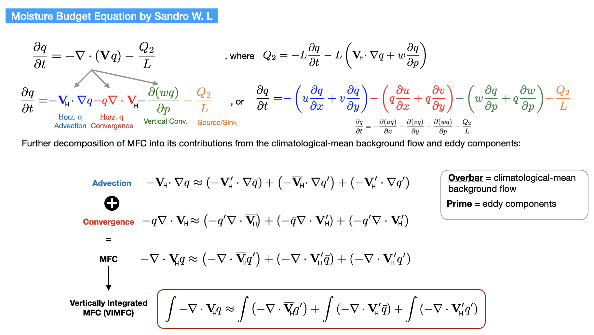

# Moisture Budget

**Sandro W. Lubis, Ph.D.**
Pacific Northwest National Laboratory (PNNL)

This repository provides **NCL and Python scripts for calculating atmospheric moisture-budget diagnostics**, including horizontal moisture advection, horizontal moisture convergence, moisture flux convergence (MFC), vertical moisture transport, and vertically integrated moisture-budget terms.

These diagnostics are useful for studying tropical variability, atmospheric convection, precipitation, atmospheric rivers, large-scale circulation, and other hydroclimate processes in which moisture transport plays an important role.

<p align="center">
  
</p>

---

## Citation
If you use or adapt this code, please cite:

**Lubis, S. W., Hagos, S., Chang, C.-C., Balaguru, K., & Leung, L. R. (2023).**
*Cross-equatorial surges boost MJO's southward detour over the Maritime Continent.*
**Geophysical Research Letters, 50**, e2023GL104770.
https://doi.org/10.1029/2023GL104770


## Overview

The atmospheric moisture budget describes the temporal evolution of water vapor through transport, convergence, storage, and physical moisture sources and sinks.

In pressure coordinates, changes in specific humidity $q$ arise from:

* horizontal moisture advection,
* horizontal wind convergence,
* vertical moisture transport,
* local moisture storage, and
* moisture sources and sinks associated with processes such as condensation, evaporation of condensate, and surface moisture exchange.

The scripts in this repository diagnose these processes at individual pressure levels and after vertical integration through the atmospheric column.

Throughout this README,

```math
\mathbf{V}=(u,v)
```

denotes the **horizontal wind vector**, where $u$ and $v$ are the zonal and meridional wind components, respectively.

---

# 1. Moisture Flux Convergence

The horizontal moisture flux is

```math
\mathbf{F}_q = q\mathbf{V},
```

where $q$ is specific humidity and $\mathbf{V}=(u,v)$ is the horizontal wind vector.

The horizontal **moisture flux convergence (MFC)** is defined as

```math
\mathrm{MFC}
=
-\nabla_h\cdot(q\mathbf{V}).
```

Using the product rule, MFC can be decomposed into moisture-advection and wind-convergence components:

```math
\mathrm{MFC}
=
-\mathbf{V}\cdot\nabla_h q
-
q\nabla_h\cdot\mathbf{V}.
```

Therefore,

```math
\mathrm{MFC}
=
\mathrm{ADV}_q
+
\mathrm{CONV}_q,
```

where

```math
\mathrm{ADV}_q
=
-u\frac{\partial q}{\partial x}
-
v\frac{\partial q}{\partial y}
```

is the **horizontal moisture-advection term**, and

```math
\mathrm{CONV}_q
=
-q
\left(
\frac{\partial u}{\partial x}
+
\frac{\partial v}{\partial y}
\right)
```

is the contribution from **horizontal wind convergence**.

This decomposition is useful for determining whether anomalous moisture flux convergence is primarily associated with the transport of moisture by the circulation or with convergence of the horizontal wind field.

---

# 2. Vertical Moisture Transport

In pressure coordinates, vertical moisture transport can similarly be separated into advection and convergence components.

The vertical moisture-advection term is

```math
\mathrm{ADV}_{q,p}
=
-\omega\frac{\partial q}{\partial p},
```

where

```math
\omega=\frac{Dp}{Dt}
```

is pressure vertical velocity.

The vertical moisture-convergence contribution is

```math
\mathrm{CONV}_{q,p}
=
-q\frac{\partial\omega}{\partial p}.
```

Together,

```math
\mathrm{MFC}_{p}
=
-\omega\frac{\partial q}{\partial p}
-
q\frac{\partial\omega}{\partial p},
```

which can equivalently be written in flux form as

```math
\mathrm{MFC}_{p}
=
-\frac{\partial(q\omega)}{\partial p}.
```

These terms describe the redistribution of atmospheric moisture by vertical motion.

---

# 3. Local Moisture Budget

The local moisture tendency is

```math
\frac{\partial q}{\partial t}.
```

In pressure coordinates, the three-dimensional moisture equation can be written schematically as

```math
\frac{\partial q}{\partial t}
=
-\mathbf{V}\cdot\nabla_h q
-
\omega\frac{\partial q}{\partial p}
+
S_q,
```

where $S_q$ represents non-advective moisture sources and sinks.

Rearranging gives

```math
S_q
=
\frac{\partial q}{\partial t}
+
\mathbf{V}\cdot\nabla_h q
+
\omega\frac{\partial q}{\partial p}.
```

In component form,

```math
S_q
=
\frac{\partial q}{\partial t}
+
u\frac{\partial q}{\partial x}
+
v\frac{\partial q}{\partial y}
+
\omega\frac{\partial q}{\partial p}.
```

This residual represents changes in atmospheric moisture not explained by resolved three-dimensional advection and may include processes associated with condensation, evaporation, precipitation formation, and other moist physical processes.

The sign convention should be checked carefully when comparing this residual with precipitation, evaporation, or model-physics tendencies.

---

# 4. Column-Integrated Moisture Budget

The atmospheric column water vapor is defined as

```math
W
=
\frac{1}{g}
\int_{p_t}^{p_s}
q\,dp,
```

where

* $g$ is gravitational acceleration,
* $p_s$ is the lower pressure boundary, and
* $p_t$ is the upper pressure boundary.

The vertically integrated horizontal moisture transport is

```math
\mathbf{Q}
=
\frac{1}{g}
\int_{p_t}^{p_s}
q\mathbf{V}\,dp.
```

The vertically integrated moisture flux convergence is then

```math
\mathrm{MFC}_{\mathrm{column}}
=
-\nabla_h\cdot\mathbf{Q}.
```

The column moisture budget can be written as

```math
\frac{\partial W}{\partial t}
=
\mathrm{MFC}_{\mathrm{column}}
+
E-P,
```

where

* $P$ is precipitation,
* $E$ is surface evaporation,
* $W$ is column water vapor, and
* $\mathrm{MFC}_{\mathrm{column}}$ is vertically integrated moisture flux convergence.

Equivalently,

```math
P-E
=
\mathrm{MFC}_{\mathrm{column}}
-
\frac{\partial W}{\partial t}.
```

Thus, precipitation minus evaporation depends on both moisture flux convergence and changes in atmospheric moisture storage.

---

## Steady-State Approximation

If changes in atmospheric moisture storage are small,

```math
\frac{\partial W}{\partial t}
\approx 0,
```

then the column moisture budget approximately reduces to

```math
P-E
\approx
\mathrm{MFC}_{\mathrm{column}}.
```

Under this approximation:

* **positive MFC** indicates net convergence of atmospheric moisture and favors positive $P-E$;
* **negative MFC** indicates moisture divergence and favors drying or reduced net precipitation.

For transient weather systems and daily or subseasonal variability, however, the storage term can be important and should not automatically be neglected.

---

# Repository Contents

```text
Moisture_Budget/
│
├── cal_mfc_850.ncl
├── cal_mfc_850.py
├── cal_moist_budget_multi_levels.ncl
├── cal_moist_budget_single_level.ncl
├── cal_vint_moist_budget.ncl
│
├── cross_products/
│   ├── advection_term.ncl
│   ├── cal_budget_decomp.ncl
│   ├── cal_filter_eddy.ncl
│   ├── divergence_term.ncl
│   ├── prep_data.sh
│   └── vort_flux_divergence.ncl
│
├── input/
│   ├── input_2001.nc
│   └── moisture_budget.png
│
├── README.md
└── LICENSE
```

---

# Main Scripts

## `cal_moist_budget_multi_levels.ncl`

Calculates the moisture-budget terms at multiple atmospheric pressure levels.

The script diagnoses quantities including

```text
dq_dt      local moisture tendency
adv_q      horizontal moisture advection
conv_q     horizontal moisture convergence
mfc        horizontal moisture flux convergence
mfc_ver    vertical moisture flux convergence
q2         diagnosed moisture source/sink
```

The horizontal moisture flux convergence satisfies

```math
\mathrm{MFC}
=
\mathrm{ADV}_q
+
\mathrm{CONV}_q.
```

The script also calculates the corresponding vertical moisture-transport terms.

---

## `cal_moist_budget_single_level.ncl`

Calculates the moisture-budget decomposition at a selected atmospheric pressure level.

Typical output variables include

```text
dq_dt
adv_q
conv_q
mfc
mfc_ver
q2
q
conv_q_zonal
conv_q_meridional
```

This script is useful when the analysis focuses on a particular level of the troposphere rather than the full atmospheric column.

The selected pressure level can be modified directly in the script.

---

## `cal_vint_moist_budget.ncl`

Calculates **mass-weighted vertically integrated moisture-budget terms**.

The vertical integration follows the general form

```math
\left\langle A \right\rangle
=
\frac{1}{g}
\int_{p_t}^{p_s}
A\,dp.
```

The script calculates vertically integrated quantities including

```text
dq_dt                moisture tendency
adv_q                horizontal moisture advection
conv_q               horizontal moisture convergence
conv_q_zonal         zonal convergence contribution
conv_q_meridional    meridional convergence contribution
mfc                   moisture flux convergence
mfc_ver               vertical moisture flux convergence
adv_q_vertical        vertical moisture advection
conv_q_vertical       vertical convergence contribution
q2                    moisture source/sink
q                     column water vapor
```

Vertically integrated moisture tendency and transport terms generally have units of

```text
kg m^-2 s^-1
```

while vertically integrated specific humidity gives column water vapor in

```text
kg m^-2
```

which is numerically equivalent to millimeters of liquid water.

---

## `cal_mfc_850.ncl`

A compact NCL script for calculating horizontal moisture flux convergence at **850 hPa**.

It evaluates

```math
\mathrm{MFC}
=
-\nabla_h\cdot(q\mathbf{V})
```

through its advection and convergence components:

```math
\mathrm{MFC}
=
-\mathbf{V}\cdot\nabla_h q
-
q\nabla_h\cdot\mathbf{V}.
```

In component form,

```math
\mathrm{MFC}
=
-
\left(
u\frac{\partial q}{\partial x}
+
v\frac{\partial q}{\partial y}
\right)
-
q
\left(
\frac{\partial u}{\partial x}
+
\frac{\partial v}{\partial y}
\right).
```

The default input files are

```text
u850.nc
v850.nc
q850.nc
```

with output written to

```text
mfc_850.nc
```

---

## `cal_mfc_850.py`

Python implementation of the 850-hPa moisture flux convergence calculation.

The script uses **xarray** and **NumPy** and directly calculates the flux-form expression

```math
\mathrm{MFC}
=
-
\left[
\frac{\partial(qu)}{\partial x}
+
\frac{\partial(qv)}{\partial y}
\right].
```

This expression is mathematically equivalent to

```math
-\mathbf{V}\cdot\nabla_h q
-
q\nabla_h\cdot\mathbf{V}.
```

Default input files are

```text
u850.nc
v850.nc
q850.nc
```

and the default output is

```text
mfc_850.nc
```

---

# Input Data

The moisture-budget scripts are designed for atmospheric data organized approximately as

```text
[time, pressure, latitude, longitude]
```

The current NCL implementations use ERA5-style variable names such as

```text
var131    zonal wind, u
var132    meridional wind, v
var133    specific humidity, q
var135    pressure vertical velocity, omega
```

Typical physical units are

```text
u, v       m s^-1
q          kg kg^-1
omega      Pa s^-1
pressure   Pa or hPa, depending on the dataset
```

Before running the scripts, users should verify:

* input and output directories;
* variable names;
* coordinate names;
* pressure units;
* pressure-level ordering;
* latitude ordering;
* longitude convention;
* temporal resolution; and
* missing-value treatment.

The scripts can be modified for datasets that use different variable names or file structures.

---

# Running the Scripts

## NCL

For the multilevel moisture budget:

```bash
ncl cal_moist_budget_multi_levels.ncl
```

For a selected pressure level:

```bash
ncl cal_moist_budget_single_level.ncl
```

For the vertically integrated moisture budget:

```bash
ncl cal_vint_moist_budget.ncl
```

For 850-hPa moisture flux convergence:

```bash
ncl cal_mfc_850.ncl
```

Input paths, output paths, pressure levels, years, and variable names can be modified directly in the scripts.

---

## Python

The Python implementation requires

```text
xarray
numpy
```

Run with

```bash
python cal_mfc_850.py
```

---

# Sign Convention

Throughout this repository, horizontal moisture flux convergence is defined as

```math
\mathrm{MFC}
=
-\nabla_h\cdot(q\mathbf{V}).
```

Therefore,

```text
MFC > 0    moisture flux convergence
MFC < 0    moisture flux divergence
```

Positive MFC represents net transport of atmospheric moisture **into** a region, whereas negative MFC represents net moisture transport **out of** a region.

For the column-integrated budget,

```math
P-E
=
\mathrm{MFC}_{\mathrm{column}}
-
\frac{\partial W}{\partial t}.
```

Thus, MFC should not necessarily be interpreted as precipitation minus evaporation when atmospheric moisture storage is changing substantially.

---

